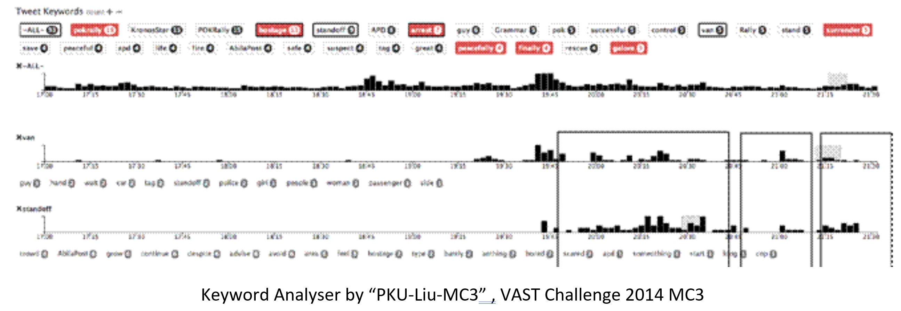

```{r setup, include=FALSE}
knitr::opts_chunk$set(fig.retina = 3,echo = TRUE, eval = TRUE, warning = FALSE, message = FALSE)
```

  

## About

The [IEEE Visual Analytics Science and Technology (VAST) Challenge]( http://www.vacommunity.org/About+the+VAST+Challenge) is an annual contest with the goal of advancing the field of visual analytics through competition. The VAST Challenge is designed to help researchers understand how their software would be used in a novel analytic task and determine if their data transformations, visualizations, and interactions would be beneficial for particular analytic tasks.  

This project is based on the VAST Challenge 2021 – The Kronos Incident [Mini challenge 3]( https://vast-challenge.github.io/2021/MC3.html) which involves analysis of a collection of microblogs and emergency calls on January 23, 2014 from 1700 to shortly after 2130 where multiple events unfolded.  

Visual analysis is used to uncover meaningful information to piece together the significant events that took place as well as provide analysis on the level of risk and recommend retrospectively where a team of first responders could have been sent to mitigated the risks more effectively. All visualisations will be created with R.  

## Overview

In the roughly twenty years that Tethys-based GAStech has been operating a natural gas production site in the island country of Kronos, it has produced remarkable profits and developed strong relationships with the government of Kronos. However, GAStech has not been as successful in demonstrating environmental stewardship.  

In January, 2014, the leaders of GAStech are celebrating their new-found fortune as a result of the initial public offering of their very successful company. During this celebration, several employees of GAStech go missing. An organization known as the Protectors of Kronos (POK) is suspected in the disappearance, but things may not be what they seem. On January 23, 2014, multiple events unfolded in the city of Abila on Kronos Island which affected the safety of the residents.  

## Data

The data contains a single data stream from two major sources:  

* Microblog records that have been identified by automated filters as being potentially relevant to the ongoing incident. These microblog records resemble tweets and are without images. The @ symbol is used to designate a username within the body of a message. Hashtags (#) are used to relate the message to specific topics. “RT” at the start of a message indicates that it the current user is re-sending another user’s message. Spam and junk messages are also common.  

* Call centre text transcripts of emergency dispatches by the Abila, Kronos local police and fire departments.  

The data stream is divided into three parts by time:    


|Source |     Time       | csv file name      | Total number of records | No. of microblog records | No. of call centre records|
|:-----:|:--------------:|:-------------------:|:-----------------------:|:------------------------:|:---------------------------:|
|Part1	|   1700 – 1830   |	csv-1700-1830.csv	| 1033 | 971	| 62 |
|Part2	|   1831 – 2000	  | csv-1831-2000.csv	| 1815 | 1724	| 91 |
|Part3	|   2001 - 2131	  | csv-2001-2131.csv	| 1215 | 1177	| 38 |

   
Each csv file contains the following information:  

|Column  |Description 	                                                   |Example
|:-------|:------------------------------------------------------------------|:-----------------------------------|
|Type	   |Indicates if the record is from the microblog (mbdata) or from the call center (ccdata). |	*mbdata; ccdata*      |
|Datetime|The timestamp of the record in the yyyyMMddHHmmss format 	                               |*2014/01/23 17:10:00* |
|Author	 |The author of the microblog text. Left blank for ccdata. 	                                | *KronosQuoth; megaMan*|
|Message |The text message. Includes retweets (RT), mentions(@) and hashtags (#). 	               |*RT @AbilaPost POK rally set to take place in Abila City Park - POK leader Sylvia Marek has begun with opening remarks #AbilaPost*|
|Latitude|Latitude of the record, for mbdata. Many missing entries. 	                             |*36.1*      |
|Longitude|Longitude of the record, for mbdata. Many missing entries. 	                           |*24.9*     |
|Location |Only available for ccdata, indicates the location of the dispatch. 	                   |*N. Carnero St / N. Pilai St* |  

## Objectives

The challenge is to use visual analytics to extract important information from the collection of records and answer the following questions:  

* What are the characteristics of junk text and important text? 

* Are retweets important?   

* Who are the influential authors in the network?   

* What is are the significant events during the evening?  

* What are the indicators of risks as the evening progressed?   

* Where were the response team deployed?   

* What distinguishes meaningful event reports from typical chatter from junk or spam?   

* Use visual analytics to represent and evaluate how the level of the risk to the public evolves over the course of the evening. Consider the potential consequences of the situation and the number of people who could be affected.   
If a team of first responders could be sent to any single place, where would it be? How might this response be different if you had to respond to the events in real time rather than retrospectively?   

This project will also document the building of suitable interactive visualisations in R to aid the analysis of the data.   

## Literature Review of Current Visualisations

The best visualisations for the VAST Challenge 2014 are published [here](http://visualdata.wustl.edu/varepository/VAST%20Challenge%202014/challenges/MC3%20-%20Real-Time,%20Streaming%20Social%20Media/). As the dataset for the 2014 Mini-Challenge 3 is the same as the 2021 challenge, I looked at some of the best visualisations that were created by the top teams.  

  

The dashboard by team [“TJU-Yang-MC3”]( http://visualdata.wustl.edu/varepository/VAST%20Challenge%202014/challenges/MC3%20-%20Real-Time,%20Streaming%20Social%20Media/entries/Tianjin%20University/), created by members for the Tianjin University for VAST Challenge 2014, Mini-challenge 3 received a Honorable Mention for good support for streaming and forensic analysis.  

The dashboard consists of a timeline, wordcloud, map and display of the tweets at the bottom allowing the user to view the events as they unfold by the timeline. There are buttons indicating that the dashboard could be linked to further visualisations. It is not shown how the user can filter the dataset interactively. If the component plots are linked and filtered, the user will be able to perceive the information effectively.  

However, it is not seen from the dashboard how RT, mentions and hashtags were analysed. In a social network, the “wisdom of the crowd” can be revealed in examining frequent retweets or mentions. Moreover, following influential and knowledgeable authors can lead to quicker identification of important events instead of filtering and examining the many messages to extract the required information manually.  

Another approach to the VAST Challenge involves using a few different interactive visual charts and switching between them as necessary.  

  

This method allowed users to focus on gaining the understanding first from one visualisation before moving on to another to drill down on further details to gain insights. Colour is applied to aid the user to see the connection between visualisations. However, filtering the data to gain insights from the specific tweets this way can be difficult as these messages are still ordered by timeline. It would be more effective if once a meaningful key author  or keyword has been identified, be able to extract all the associated messages for analysis.   

For example, team [“PKU-Liu-MC3”]( http://visualdata.wustl.edu/varepository/VAST%20Challenge%202014/challenges/MC3%20-%20Real-Time,%20Streaming%20Social%20Media/entries/Peking%20University/) created a keyword analyser to identify the time period where certain keywords are trending to identify key events.      

   

Most of these approaches relied on using maps, timelines and some form of display of the actual text message.  

## Suggested Visualisations

Majority of the interactive visualisations presented the messages from a timeline view. While this is important, meaningful messages tend to originate from only a few authors in a social network and tend to be quickly retweeted or mentioned again. Hence, it would be useful to have the messages visualised by author, hashtag or mention frequency for influential and meaningful messages to be quickly identified.   

Using the “wisdom of crowd” in a social network can also be helpful in understanding the situation on the ground. User given hashtags can be important filters in a rapidly escalating situations where there are many text outputs. Also, frequent keywords or trending hashtags can provide an indication of how a situation is evolving. 

In this project, interactive visualisations similar to a dashboard will be created to place all the key information such as time, author, mentions, text message, etc into a single visualisation for the initial exploration. This will allow the user to see how the events unfold and identify the indicators of important messages.   

In particular, we will use the R [Plotly]( https://plotly.com/r/) package as it has a customisable filters and a number of interactive features. Instead of scrolling datatables used by the visualisations in the literature review, I will use *plotly tooltip* so that the user will not need to divert attention away from the chart to view the messages. Since the messages are short tweets, they will also fit comfortably in the chart space and appear on hover when needed.   

  
  


