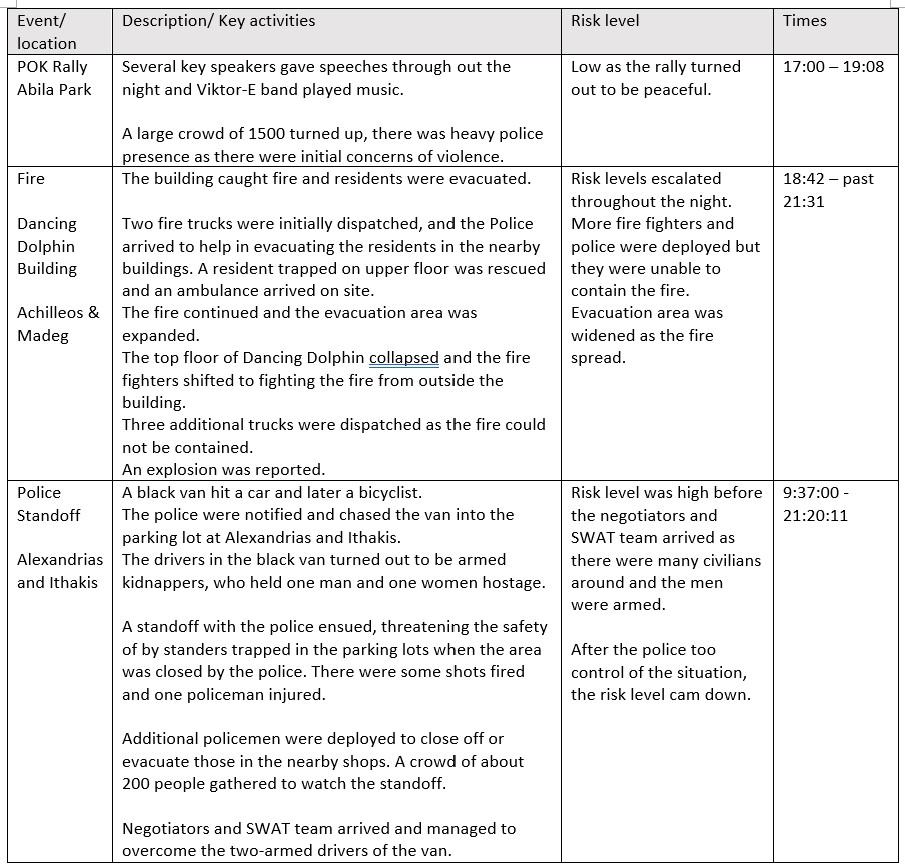
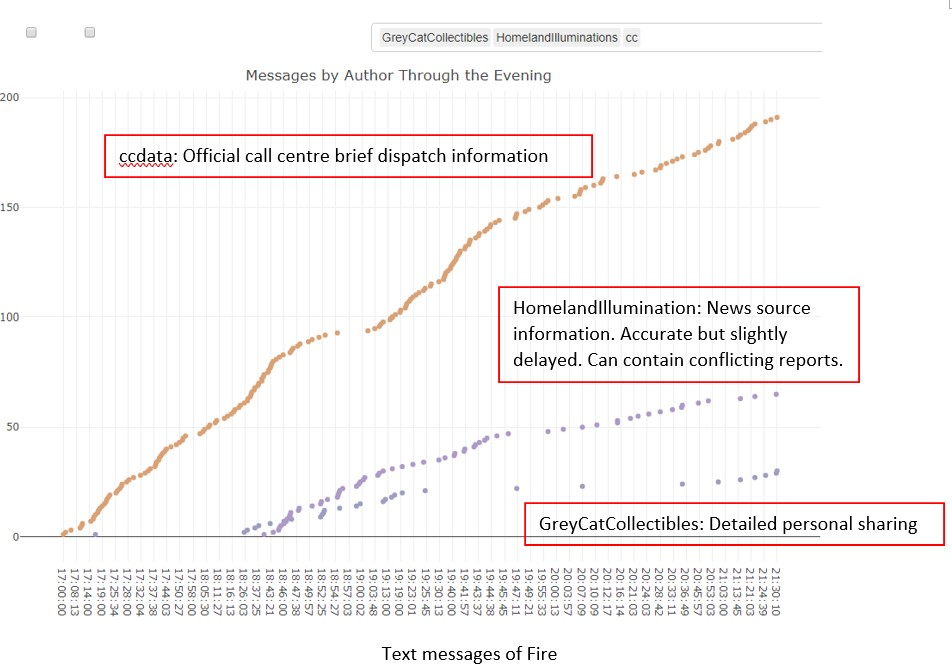
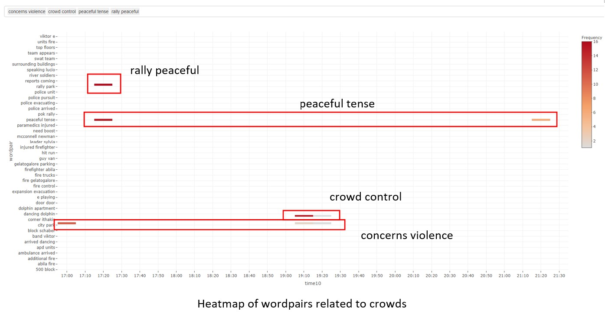
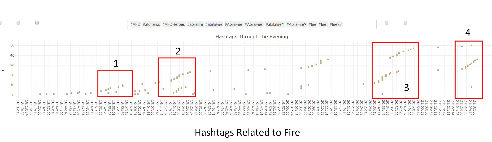
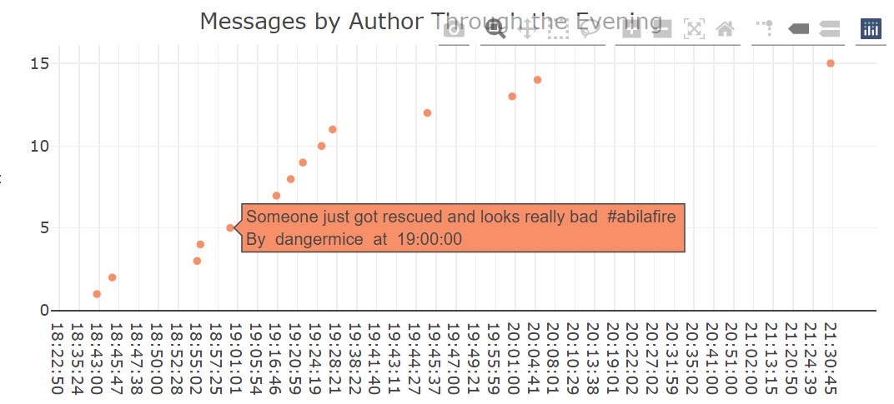
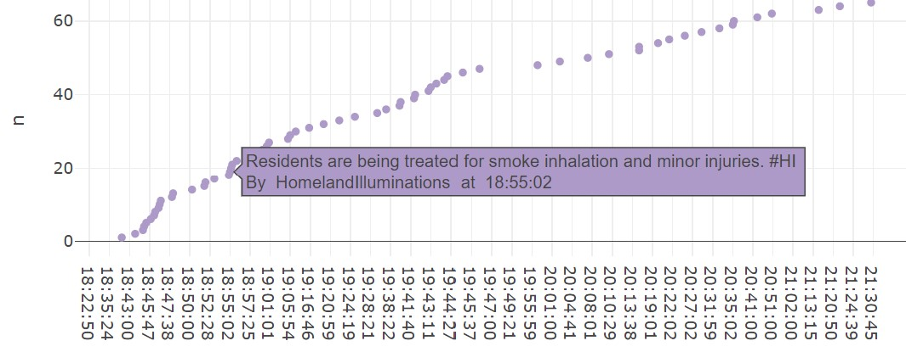
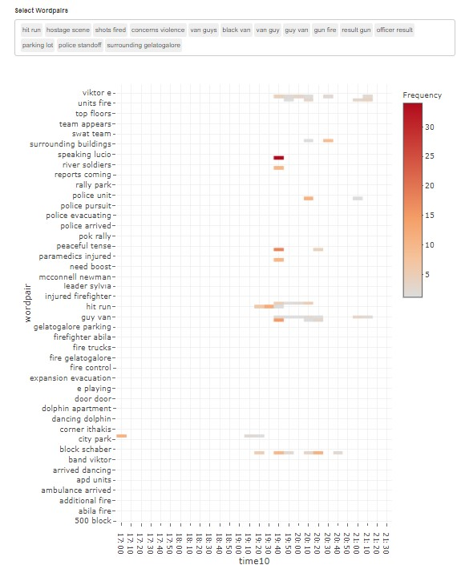
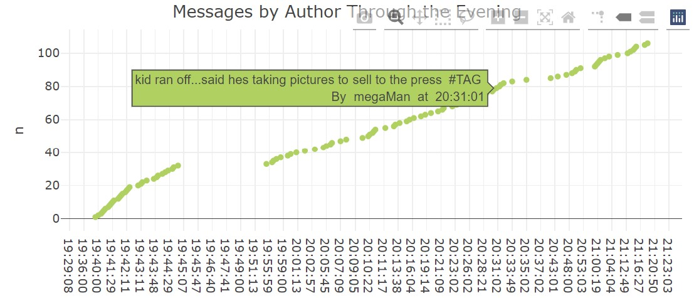
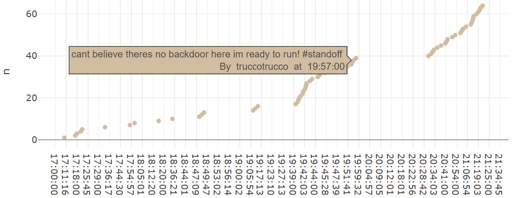

```{r setup, include=FALSE}
knitr::opts_chunk$set(fig.retina = 3,echo = TRUE, eval = TRUE, warning = FALSE, message = FALSE)
```

## What do you need to know?

### Events

Three major events have been identified by exploring the dataset

A.	POK rally at Abila City Park 
B.	Fire at Dancing Dolphin
C.  Police Standoff at a parking lot near Alexandrias and Ithakis 

  
### Groups of Authors 

News Sources
* News: "AbilaPost", "KronosStar","CentralBulletin", "HomelandIlluminations", "InternationalNews", "NewsOnlineToday"

Official Sources
* Official: "AbilaFireDept", "AbilaPoliceDepartment"

Call Centre text dispatch messages 
* "cc"

Authors of Interest (identified by exploring the dataset)
* Interest: "truccotrucco", "megaMan", "ben", "GreyCatCollectibles", "sofitees", "hngohebo_ABILAPOST", 

The rest
* Others 


## What distinguishes meaningful event reports from typical chatter from junk or spam?  

Using count, RTs, mentions and hashtags are effective blunt filter for junk and spam. 

1. Count  

The frequncy of tweets can give us an indication of whether they are meaningful. For example, we excluded *KronosQuoth* and *Clevvah4Evah* as these authors have posted an extrodinary amount of tweets and hashtags, but with no mentions or RTs. 

2. Mentions Network Graph 

The social network in the micro-blog data revealed the groups of authors in the network. 
Of the centrality measures that was used, degree centrality using the out strength was able to identify more informative authors and I was able to identify the new sources and some authors of interest. 
The news group proved to be the most valuable and informative sources of information. 

3. Dot Plot of RTs and Mentions

The RTs and mentioned text messages alone were able to give a good overview of the key events of the evening as users of the social network are keen to pass on informative knowledge. Identifying news sources and key authors of interest in the network helped to zoom in on the important messages quickly. 
 
The dot plot allows for filtering of RTs. I found that RTs with mentions are more informative than non-RT tweets, especially if the author is a credible source or popular authority in the social network, like the news.

4. Dot Plot of Hashtags

From the barchart of hastags, we see that the number of hashtags in a tweet is not a good indicator of the quality of the message. However, using the "wisdom of crowds", the *#hashtags* dot plot is an effective method of building a understanding of the sequence of events once the events have been identified. 
For example, the user can pick out the relevant hashtag keywords from the dropdown list and do some further filtering by time to narrow down the search. 
In general, hashtags that are more specific, like "#dancingdolphinfire" as opposed to "#fire" gives more meaningful messages. 


### Layered approach to uncovering meaningful information 

More meaningful analysis can be done after the time line and authors of interest are found by employing a layered method of extracting information to the detail required by using the Dot Plot visualisation. 

For example, to uncover the risk level related to the Fire at Dancing Dolphin, i looked at three layers of information that the Dot Plot of Authors Messages provides:

 

At the top layer is the official call center *cc* transcripts which shows accurately the type and number of emergency vehicles dispatched. The information is not delayed but it is too brief and cannot be understood without context. 

We will add a mid layer information from one of the news source. Selecting between news source is done by using the pull down or by simply typing the name of the author. There are 6 news sources identified and usually the source with the highest counts provides more comprehensive information. The dot plot reflects the count on the y-axis so we can also identify the news source that is currently trending by judging from the steepness of the plot for that time period. 
News sources provides a good overview of the development. However their information can be slightly delayed and can also contain conflicting reports as the information is not from first hand. 

If there is a need to drill down the details, a bottom layer can be included by using either the network or wordpairs heatmap to identify key authors that are on the ground. For the Fire at Dancing Dolphin, we have identified *GreyCats Collectables* who lives at *Dancing Dolphin*. She shared many details in her tweets, but some tweets maybe irrelevant to the fire. 


## Use visual analytics to represent and evaluate how the level of the risk to the public evolves over the course of the evening. Consider the potential consequences of the situation and the number of people who could be affected.   


Heatmaps of wordpairs are indicative of how often the wordpair is mentioned in the 10 minnutes interval. In a social network, topics tend to trend and then die down fairly quickly. If there is a surge in the frequency of the wordpair again, we can expect it to be about a new development.  

The heatmap of wordpairs related to "crowds" shows that there there were concerns about violence at the start of the POK Rally, but about 20 minutes later, the fears of violence were unfounded as the trending words are "rally peaceful" and "peaceful tense". The rally turned out to be peaceful as teh evening progressed due to a "strong police presence".  

The heatmap shows a resurgence of "crowd control", which coincided with the end of the rally amd "peaceful tense" which coincided with the end of the police standoff.    

  

From the Dot Plot of Messages by Authors, *AbilaPost* reported a crowd of 1200 attendees with "strong Police presence" at 17:26. 

[](Img/risk5.jpg) 


The heatmap of fire related wordpairs shows how the fire has continued to develop over the evening. There are two periods, 18:40 and 19:20, where the terms related to fire intensified before the top floor collapsed
 
The hashtags of fire related words shows 4 periods where the danger level increased. 

Period 1: Evacuation of residents of Dancing Dolphin. Rescue of trapped resident. 
Period 2: Expansion of evacuation perimeter to surrounding buildings
Period 3: Firemen running away from building, top floor collapsed. 
Period 4: Explosion heard from inside of building, several people down. 
 
 

We learn from the firsthand account of *dangermice* that there was one person injured in the fire and also there are "lots of displaced people" as they have been evacuated. 
 
The fire has continue to grow, affecting three groups of people: 

1. Residents of Dancing Dolphin are homeless or injured due to smoke inhalation or burns. There is one women who was taken to the hospital as reported by *dangermice*. This group has lost their home to the fire. Many of them are close enough to watch to fire and could potentially be injured by the explosion that took place in period 4. 

 
2. Residents of surrounding buildings are homeless and some could also loose their home if the fire is not contained. Like the residents of Dancing Dolphin, they could be close enough to the explosion in period 4 to get injured. 
Due to the explosion, the evacuation area could be further expanded and this group of people could increase if the fire is not contained. 

3. General public are inconvenienced by the road closures due to the evacuation.

The heatmap of the police standoff shows that there is a fading interest in the event as the wordpair frequencies shows a decrease over time.  
 
First hand accounts by authors like *megaMan* and *truccotrucco* shows that the police were able to control the situation quite quickly. However the by-standers were not taking the standoff seriously.  

*megaMan* tweeted that “groups of people running out of stores” and “People trying to leave in their cars - polic says no.” adding to the chaos of the moment and raising the risk level as the people in the black van are still armed. The AbilaPost reported “close to 200 people have gathered to watch standoff…” at 20:22:21. There was also a kid who was risking his life to take picture.  

 
There are three groups of people affected by the standoff and their risk level is different depending on their situation:  

1. People trapped in the parking lot are potentially in the line of fire from the armed drivers. They had hid when they heard the shots and the Police had moved in to evacuate them. But like *megaMan* some would refuse tobe evacuated, exposing themselves to risk of getting shot. 

2. People who are trapped in the restaurants by the police. These are people like *truccotrucco* and *sofitee* and kept safe by the police. Unless they do something drastic like run out of the restaurant, they are safe. 
 

3. By-standers who came to watch the standoff are kept safe by the police who are controlling access to the area. But those who managed to sneak into the parking lot to view the standoff are exposing themselves to higher risks. 

## If a team of first responders could be sent to any single place, where would it be? How might this response be different if you had to respond to the events in real time rather than retrospectively?   

As the fire poses a higher level of risk compared to the rally or standoff, the team of first responders could have been sent to the Dancing Dolphin appartment to control the fire before it escalates further. 

