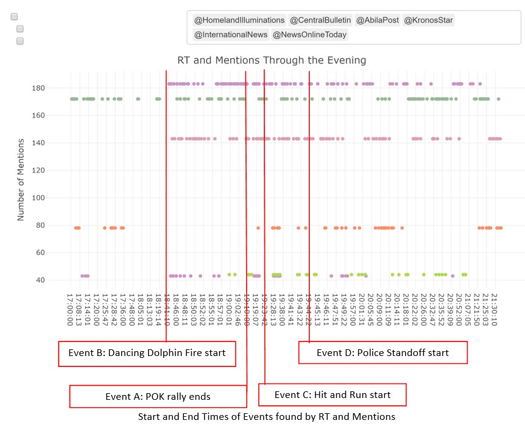
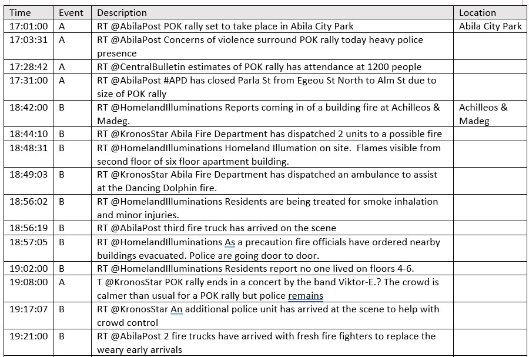
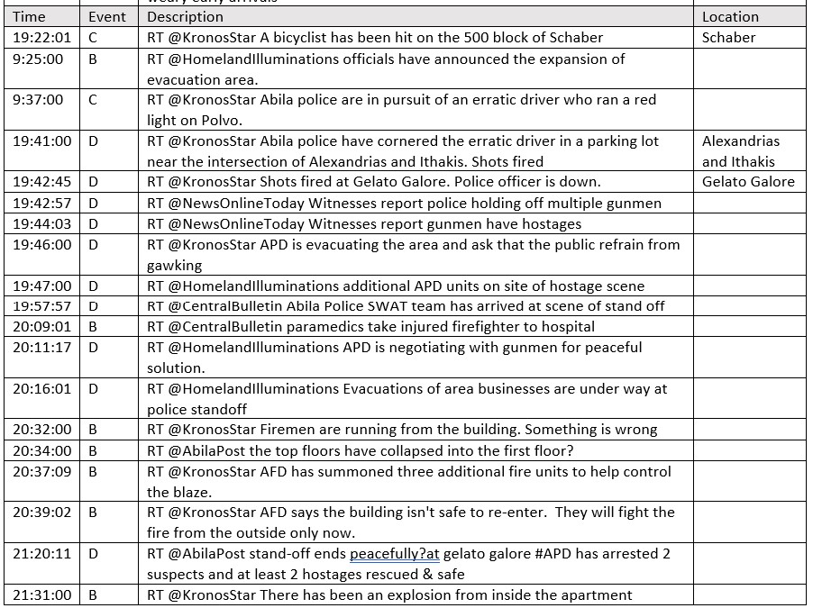
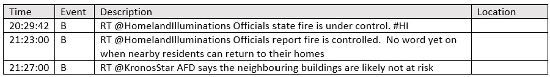
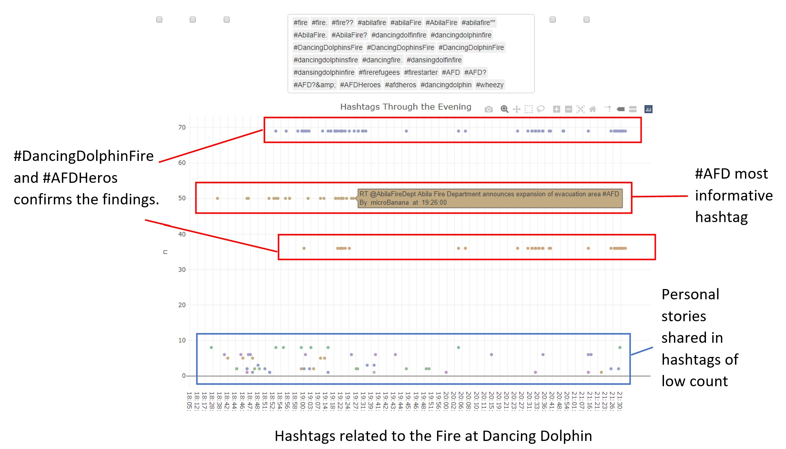
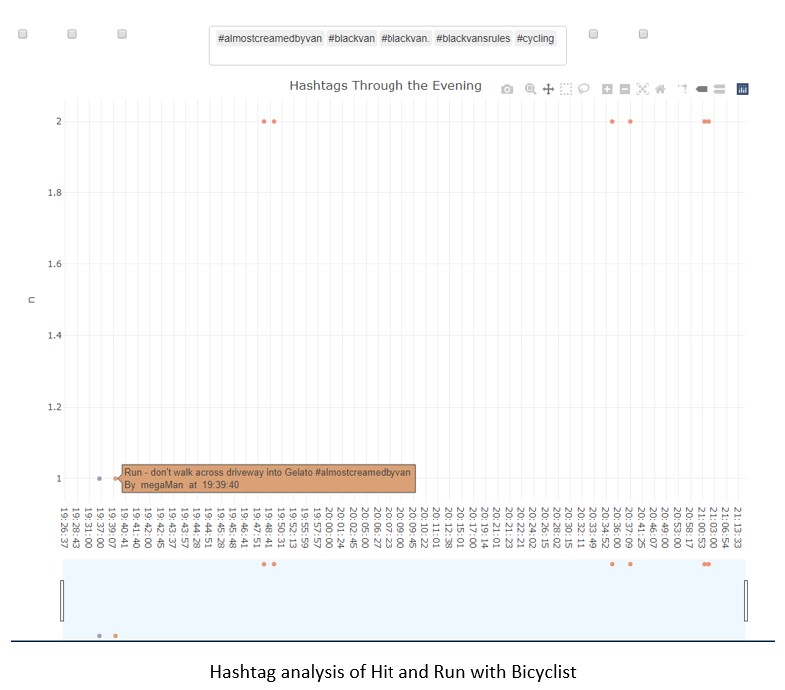
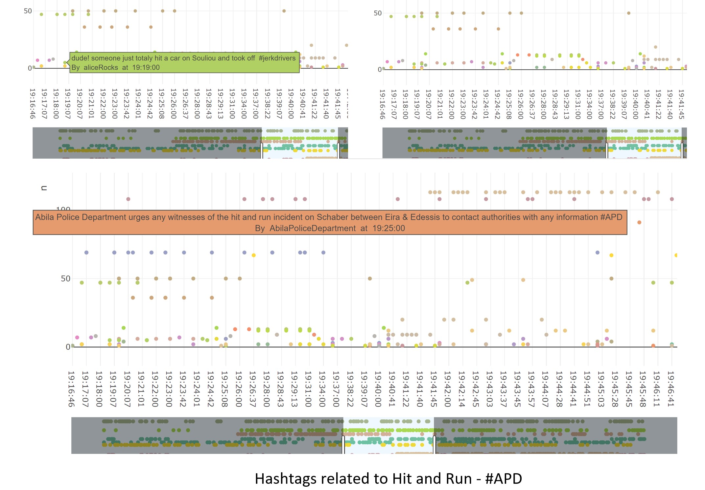
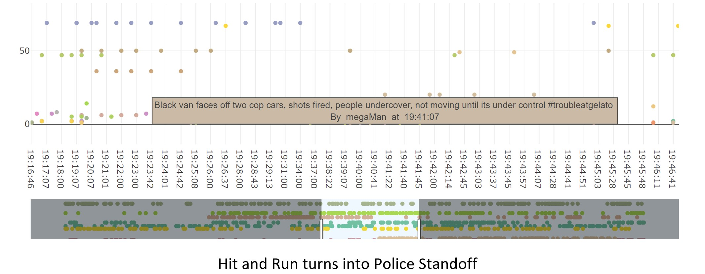
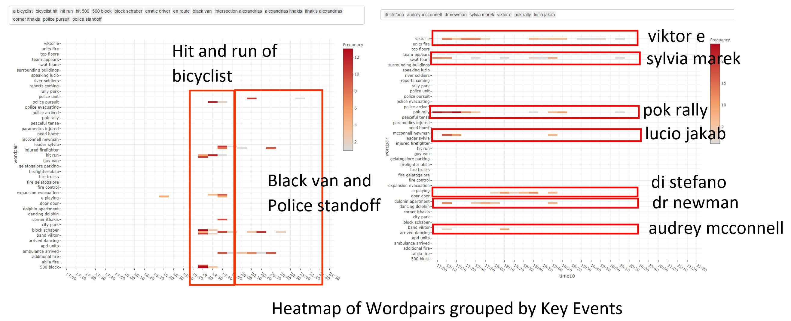
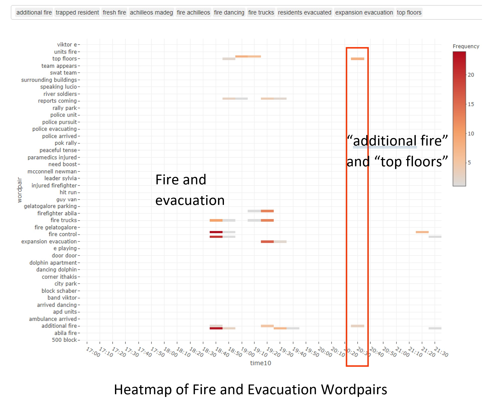

```{r setup, include=FALSE}
knitr::opts_chunk$set(fig.retina = 3,echo = TRUE, eval = TRUE, warning = FALSE, message = FALSE)
```

This project assumes that the user is unaware of the actual sequence of events and seeks to uncover them solely from the visualisation. Hence the methods outlined here can involve extra steps to cross check and verify if some assumptions made on the initial observations are consistent through. Since this dataset mimics an actual microblogging social network, there will be some inconsistencies in the tweets. In such cases, I had chosen to keep observations that are in line with the overall analysis and point out inconsistencies for readers to make further analysis.   

A sizable number of messages in this dataset are retweets (RTs). In most microblog analysis, RTs are removed, leaving only unique messages as RTs are essentially duplicate messages that can skew the analysis. However, for this project, RTs are kept as the frequency of RT messages is an indication of how many authors are also experiencing the same situation as the RT.   

## Data Preparation 

The data from the three csv files are first extracted and combined into one tibble dataframe for wrangling using the R tidyverse suite of packages. (You can find out more about tibble dataframe [here](https://r4ds.had.co.nz/tibbles.html).  

## Install and load all necessary packages

The following packages are loaded:   

```{r}
packages = c('tidyverse', 
             'ggplot2',  #static plots
             'plotly',   #interactive plots
             'crosstalk',  #html widgets
             'lubridate', #format datetime
             'date', #functions for handling dates
             'hms',   #format time
             'VIM', #visualise missing values
             'patchwork', #combination plots
             'tidygraph', #tidy graph manipulation
             'igraph', #graphing networks
             'ggraph',  #graphing networks
             'visNetwork',  #graphing interactive networks
             'tm', #text analysis
             'tidytext', #text analysis,
             'raster', #geospatial map
             'sf', #nap shape layer
             'tmap' #plot map
             )
for(p in packages) {
  if(!require(p,character.only = T)){
    install.packages(p)
  }
  library(p, character.only = T)
}
```

## Import and extract relevant data

The three csv files have the same structure and column headers, *read_csv* is used to import and extract the relevant columns from each file into R and *map_dfr* is used to append the three files into a one. A new column, *source*, is created to append the name of the csv file that the row was extracted from.  

```{r}
df_list <- list.files(path = "./New/",pattern=".csv", full.names = TRUE)
comb <- df_list %>% 
  set_names() %>%
  map_dfr(read_csv, .id = "source")
```

The datetime column is a string of digits,  yyyyMMddHHmmss, *gsub* is used to split and insert the separators so that the string is now in the form * "d/m/Y H:M:S". Next, *as.Date* is used to change the format to *date time* and to further extract the time component. *as_hms* from the [hms](https://www.rdocumentation.org/packages/hms/versions/1.1.0) package is used to convert it into a *time* format.   

```{r}
comb$datetime <- gsub("^(\\d{4})(\\d{2})(\\d{2})(\\d{2})(\\d{2})(\\d{2})$",
                      "\\3-\\2-\\1 \\4:\\5:\\6", 
                      comb$`date(yyyyMMddHHmmss)`, 
                      perl=TRUE)

comb$datetime <-strptime(comb$datetime,format = "%d-%m-%Y %H:%M:%S")
comb$date <- as.Date(comb$datetime, format = "%d/%m/%Y H:M:S")
comb$time <- format(as.POSIXct(comb$datetime,format="%d-%m-%Y %H:%M:%S"),"%H:%M:%S")
comb$time <- as_hms(comb$time)
```

The data frame is converted to a tibble using *as_tibble*. As the records are from a microblog which can contain some special characters, all columns of the *character* type converted to *UTF-8*.   

```{r}
comb <- as_tibble(comb) %>% mutate_if(is.character, function(col) iconv(col, to="UTF-8"))
```

The filenames in *source* are quite long, so they are renamed as *”Part1”*, *”Part2”* and *”Part3”* respectively. I also renamed *message* to *text* for better comprehension.  

```{r}
comb1 <- comb %>% dplyr::select(-`date(yyyyMMddHHmmss)`)%>% 
  dplyr::rename(Text = message) %>% 
  mutate(source = recode(source, 
                         `./New/csv-1700-1830.csv`="Part1",
                         `./New/csv-1831-2000.csv`="Part2",
                         `./New/csv-2001-2131.csv`="Part3" ))

```

Create a new row to detect if the message is a RT by using *str_detect* and regular expression pattern.   

```{r}
comb1 <- comb1 %>% 
  mutate(is_RT = case_when(str_detect(Text, "^RT @") ~ "True", TRUE ~ "False"))
```

Use *glimpse* to view the columns of the dataset and check that the data type is correct.  

```{r}
glimpse(comb1)
```

*source*, *type*, *author*, *Text*, *location* and *is_RT* are of the *character* type as required, while *datetime* is of the *datetime* type, *date* is of the *date* type, *time* is of the *time* type and *latitude* and *longitude* are number strings denoted by *dbl* as required.   

Create a stacked bar chart using *ggplot* to view the distribution of data type by source.   

```{r}
comb1 %>% group_by(source) %>% 
  count(type) %>% 
  ungroup() %>%
  ggplot(aes(x= source, y =n, fill = as.factor(type))) + 
  geom_col() + 
  labs(title = "Distribution of data type by source file", 
         x = "Source file", 
         y = "Number of records", fill= "Type") + 
  geom_text(aes(label = n), size = 3, position = position_stack(vjust = 0.5))

```
There are much fewer *ccdata* compared to *mbdata*. 

## Creating Visualizations to Explore the data

The [VIM](https://cran.r-project.org/web/packages/VIM/index.html) package provides a function that gives us a visualisation of the missing values. 

```{r}
aggr(comb1,plot = TRUE,bars=TRUE)
```
As documented in the [source](https://vast-challenge.github.io/2021/MC3.html), *author*, *latitude* and *longitude* are unavailable for all *ccdata*.  *location* is unavailable for all *mbdata* while *latitude* and *longitude* are unavailable for most of the *mbdata*.   

### Grouped Bar Chart by Author 

None of the tweets are missing so I will proceed to group the *mbdata* by *author* to find the number tweets made by each author that evening. I will also create columns to count the number of mentions made by the author and the number of hashtags used.   

```{r}
comb2 <- comb1 %>% 
  filter(type=="mbdata")  %>% 
  dplyr::group_by(author) %>% 
  summarise(no_of_tweets = length(Text), 
            hashtags = sum(str_count(Text, "#\\S+")), 
            mentions = sum(str_count(Text, "@\\S+")), 
            retweets = sum(str_count(Text, "RT @"))) %>%
  arrange(desc(no_of_tweets), .by_group=TRUE)
```

*plotly* is used to create an interactive graph to explore the relationship between the authors and the metrics. The coloured legend at the upper right-hand side allows users to click and filter the chart base on the metric they want to view. *plotly* also allows users to zoom in to view specific sections of the dataset in greater detail. A *tooltip* is activated upon hover so that the user can see all the metrics for that author.   

```{r}
p <- comb2 %>% 
  plot_ly(x=~author, y=~no_of_tweets, 
          type ='bar', 
          name = 'Number of Tweets', 
          hoverinfo = 'text',
          text = ~paste(author, "</br></br>Tweets: ",
                        no_of_tweets, "</br>Hashtags: ", 
                        hashtags, "</br>Mentions: ", 
                        mentions,"</br>Retweets: ", retweets)) %>% 
  add_trace(y =~hashtags, name = 'Number of Hashtags') %>% 
  add_trace(y =~mentions, name = 'Number of Mentions') %>% 
  add_trace(y =~retweets, name = 'Number of Retweets') %>% 
  layout(title = "Text Metrics by Author", 
         yaxis = list(title = 'Count'), 
         barmode = 'group') 

p
```

Filtering for only *Number of Tweets* and *Number of Hashtags* by clicking on the legend, we see that there are two authors, *KronosQuoth* and *Clevvah4Evah*, who had posted huge number of tweets and hashtags. *Clevvah4Evah* sent an average of 4.7 tweets per minute with an average of 2 hashtags per text message. While *Clevvah4Evah* sent an average of 0.6 tweets per minute with an average of 3 hashtags per text message. From *tooltip*, we find that these two authors do not have any mentions or RTs, hence they look very suspicious and further exploration will be done to check if they are indeed authors posting authentic text or just spam bots.   

```{r}
comb1 %>% dplyr::filter(author == "KronosQuoth") %>% dplyr::select(Text)
```
Tweets by *KronosQuoth* are composed of pseudo-sayings with several duplicated messages. They are mostly appended with *#POKRally* and *#HI* but the content is unrelated to the rally.   

```{r}
comb1 %>% dplyr::filter(author == "Clevvah4Evah") %>% dplyr::select(Text)
```
Tweets by *Clevvah4Evah* are random statements that also contains several duplicated messages. They are mostly appended with *#POK* , *#Rally* and *#Grammar* but once again, the content is unrelated to the rally. We will drop these two authors from subsequent analysis as they are not meaningful.   

## Mentions Network Graph

Even though we have removed 1418 records by filtering away *KronosQuoth* and *Clevvah4Evah*, the dataset is still too large to read all the entries in detail. I choose to use *RTs* and *mentions* as a blunt filter for the important messages because important messages are more likely to be echoed as a mention or RT by other users in the social network.  

In our graph network, the edges will point away from the source author. For example *rrWine* posted the following message *” RT @AbilaPost POK rally set to take place in Abila City Park …”*. *AbilaPost* is the source of the message hence a link will point away from *AbilaPost* to *rrWine* in the network. The number of out going links shows how many messages by the source author has been retweeted and will be used as the weight.  

To prepare the dataframe, I extracted all the mentions from each tweet using *str_extract_all* and a regular expression pattern. Next, *unnest* will convert the mentions into a row of its own. *group_by* and *add_tally* counts the number of mentions by the same author, which will be used as the weights.   

```{r}
comb1_mentions2 <- comb1 %>% 
  mutate(mentions = str_extract_all(Text, "@\\S+")) %>% 
  unnest(mentions)%>% 
  group_by(mentions) %>% 
  add_tally()  %>% 
  ungroup() %>% 
  arrange(time)

comb1_mentions3 <- comb1_mentions2 %>% 
  mutate(mentions = str_remove(mentions, "^\\@"))
```

For the node set, I extracted the set of unique authors from the *author* column and the set of unique *author* from the *mentions*. *visNetwork* requires the nodes labels to be named as *label*, so rename *author* as *label*. Use *full_join* to obtain all the unique authors from both sets.  

```{r}
author_unique <- comb1_mentions3 %>% 
  dplyr::select(author) %>% 
  distinct(author) %>% 
  rename(label = author)

mentions_unique <- comb1_mentions3 %>% 
  dplyr::select(mentions) %>% 
  distinct(mentions) %>% 
  rename(label = mentions)

nodes <- full_join(author_unique, mentions_unique, by = "label") %>%
  arrange(label)
```

The next part of the code appends an *id* to each node for the creation of the edge set. 

Here, I also included the code to create the groups found from my exploration of the network. I will include the colour coding in the rendered graph so that it is easier to see the different author groups. How these groups are found will be discussed shortly with the visualisation below.   

```{r}
nodes <- nodes %>% 
  rowid_to_column("id") %>% 
  mutate(group = if_else(label == "AbilaPost" | 
                           label == "KronosStar" | 
                           label == "CentralBulletin" | 
                           label == "HomelandIlluminations" |
                           label == "InternationalNews"| 
                           label == "NewsOnlineToday", "news", 
                         if_else(label == "AbilaFireDept" |
                                   label =="AbilaPoliceDepartment", 
                                 "official" , 
                                 if_else(label == "truccotrucco"| 
                                           label == "megaMan"|
                                           label == "ben" | 
                                           label == "Simon_Hamaeth"| 
                                           label == "sofitees" | 
                                           label == "hngohebo_ABILAPOST",
                                      "interest",  
                                      "others")
                                 )
                         )
         )
```

Next, I create the edge set by using *select* to extract the required columns. Each edge is created from *mentions* to *author* and *Text* is included so that it can be displayed in *tooltip* later.  


```{r}
edge <- comb1_mentions3 %>% dplyr::select(author, mentions, Text)
```   

Obtain the id of the "from" and "to" nodes using *left_join* with the node set.  

```{r}
edges <- edge %>% 
  left_join(nodes, by = c("mentions" = "label")) %>% 
  rename(from = id)

edges <- edges %>% 
  left_join(nodes, by = c("author" = "label")) %>% 
  rename(to = id) %>% rename(title = Text)
```

Use *add_tally* to obtain the degree of each *mention* node to be used as the weight.  

```{r}
edges <- dplyr::select(edges, from, to,title) %>% 
  group_by(from) %>% 
  add_tally() %>% 
  ungroup() 
```
Add the weight, *n*, to the node set.  


```{r}
nodes <- nodes %>% 
  left_join(dplyr::select(edges, n, from), by = c("id" = "from")) %>% 
  distinct(id, label, group, n) %>%  
  rename(value = n)  
```

Two common measures of the importance of a node in a network is the degree centrality and betweenness centrality. The strength is defined as the sum of the weights of all edges incident to a node. We calculate node strengths by passing the argument weights to *centrality_degree()*. Since our network is directed, we will use the out-strength as our measure of degree centrality.   

Betweenness centrality quantifies the number of times a node acts as a bridge along the shortest path between two other nodes. There are only 8 nodes with a betweenness score that is greater than zero.  

Both degree centrality and betweenness centrality will be found using the *tidygraph* package. Visualising the top 10 authors for each measure using a bar chart created using the *ggplot* package.  

```{r}
mentions_graph <- tbl_graph(nodes = nodes, edges = edges, directed = TRUE)
mentions_graph %>%
  activate(edges) %>%
  arrange(desc(n))

g <- mentions_graph %>% 
  activate(nodes) %>% 
  mutate(
    in_strength = centrality_degree(weights = n, mode = "in"), 
    out_strength = centrality_degree(weights = n, mode = "out"),
    strength = centrality_degree(weights = n, mode = "all")) %>%
  as_tibble()

gp <- g %>% 
  arrange(desc(out_strength)) %>% 
  top_n(10,out_strength) %>% 
  mutate(label = fct_reorder(label, out_strength)) %>% 
  ggplot(aes(x = label,y = out_strength, fill = label)) + 
  coord_flip() + 
  geom_col(show.legend = FALSE) + 
  labs(title= "Centrality degree of Authors by Out Strength", 
       x = "Authors", y = "Out Strength")

g1 <- mentions_graph %>% 
  activate(nodes) %>% 
  mutate(betw = centrality_betweenness()) %>% 
  arrange(desc(betw)) %>% 
  as_tibble()

gp1 <- g1 %>% 
  slice_head(n = 8) %>% 
  mutate(label = fct_reorder(label, betw)) %>% 
  ggplot(aes(x = label,y = betw, fill = label)) + 
  coord_flip() + 
  geom_col(show.legend = FALSE) + 
  labs(title= "Betweeenness Centrality of Authors", 
       x = "Authors", y = "Betweenness Centrality")

gp + gp1
```
 
There are some overlaps in the nodes identified by the centrality measures and we will take a closer look at them using a network graph.   
The [ggraph]( https://www.rdocumentation.org/packages/ggraph/versions/2.0.5) package allows me to use the *centrality_closeness* as the colour and *centrality_betweenness* as the size in the network. The resulting static graph shows that there is a node with high closeness and betweenness centrality, however it is difficult to identify it as the graph is too cluttered.   

```{r}
g2 <-
  ggraph(mentions_graph, layout = "nicely") + 
  geom_edge_link(edge_colour = "gray77", alpha = 0.5) +
  geom_node_point(aes(colour = centrality_closeness(), size=centrality_betweenness())) +
  theme_graph() + scale_colour_gradient(low = "#00008B", high = "#63B8FF") + 
  geom_node_text(aes(label = label,size=25), repel = TRUE) + 
  ggtitle("Network Graph of Mentions using Centrality") + theme(text=element_text(family="mono"))

g2
```
I will use an interactive network graph of *authors* to visualise the *mentions* and *RTs* to overcome the issues in a static graph. The interactivity will allow me to visualise and identify important nodes in the network and *tooltip* will be used to display the *text message* so that I do not need to filter the data table for it. I will also use the network to further investigate the top authors identified by the centrality measures.   

```{r}
legend_nodes <- data.frame(label = unique(nodes$group))

visNetwork(nodes, edges, 
main = "Network of Mentions", 
height = "500px", 
width = "100%") %>% 
visEdges(arrows = "top")%>% 
visIgraphLayout(layout = "layout_as_star")%>%  
visInteraction(dragNodes = TRUE, 
dragView = TRUE, 
zoomView = TRUE, 
multiselect = TRUE,
navigationButtons = TRUE, 
tooltipStyle = 'position: fixed;visibility:hidden;padding: 5px;white-space: wrap;
 font-family: cursive;font-size:12px;font-color:purple;background-color: blue;') %>%
  visNodes( labelHighlightBold = TRUE, font = list(size=30), shape="box") %>%
  visOptions(highlightNearest = list(enabled = TRUE, 
                                     hover = FALSE, 
                                     algorithm ="hierarchical"),
             nodesIdSelection = list(enabled = TRUE, 
                                     main = "Mentioned"),
             selectedBy = list(variable="group", main="Type"))  %>%
  visLegend(width=0.2, position="right", zoom=FALSE, useGroups = TRUE) 
```
The [visNetwork](https://cran.r-project.org/web/packages/visNetwork/vignettes/Introduction-to-visNetwork.html) package allows users to build interactive network visualisations. It was selected for its capabilities in handling large number of nodes by it *visPhysics* layout function, and also its intuitive *highlighting* and *drag* functions when analysing the graph.   

When creating the network and testing the layout options, I found that *visPhysics* produces the best layout as the nodes are spaced apart with no overlaps and it is easy to see the nodes with the most edges. However, the network graph is too large for the graph to stabilise, ie. in the visualisation the network will not stop “trembling”. Running this option is also computationally taxing and graph will be slow to render. Hence, I will only show the screenshots of the network produced by *visPhysics* function and use the *visIgraphLayout* option in the code chunk below. The code chunk for the *visPhysics* function will be included in the appendix if the reader is keen to try it out another time.   

   

From the network graph, I first locate the nodes identified with high degree centrality scores. By hovering on their links to read some of their tweets, I discovered the outgoing links of the top nodes are retweets of informative news reports. Hence, I grouped *AbilaPost*, *KronosStar*, *CentralBulletin*,*HomelandIlluminations*, *InternationalNews*, *NewsOnlineToday* as *news*.   

   
Other authors with high degree centrality are *megaMan*, *truccotrucco* and *ben*.  

   

From their tweets, we learn that *megaMan*and *ben* knows each other, and they are passing information about a situation involving a black van and the police. Their most retweeted message was “@ben ITS THE SECOND VAN GUY!”. Examining the content of *megaMan* and *truccotrucco* reveals that they were both tweeting about a standoff between a black van and the police outside gelatogalore, with *megaMan* being a close observer of the black van and *truccotrucco* inside gelatogalore when the standoff was taking place.   

  

Other nodes with high degree centrality or betweenness scores are *FriendsOfKronos*, *POK* and * Choconibbs*.  They were all mainly tweeting about the POK Rally, with *POK* giving updates and supporting the rally and *FriendsOfKronos* and * Choconibbs* criticising and dismissive of the rally. Tweets from *trollingsnark* were mainly criticisms or disparaging remarks. As his messages were not meaningful, we will exclude them for further analysis.  

Finally, *hngohebo_ABILAPOST* posted one text message and retweeted another. Both tweets were about a hit and run involving a bicyclist near Schaber.  

  
After exploring the network graphs, the nodes were grouped as follows: 

* News: "AbilaPost", "KronosStar","CentralBulletin", "HomelandIlluminations", "InternationalNews", "NewsOnlineToday"

* Official: "AbilaFireDept", "AbilaPoliceDepartment"

* Interest: "truccotrucco", "megaMan", "ben", "Simon_Hamaeth", "sofitees", "hngohebo_ABILAPOST"

* Others: the rest 

It is interesting to note that *Viktor-E* was the only author who mentioned himself. Also since regular expression was used to extract the authors in the mentions, a message with a missing space caused *dancingdolphin?#AbilaPost* to be recorded as a different author from the actual *dancingdolphin*. The error was easy to spot as the nodes were arranged alphabetically.  

## Dot Plot of RTs and Mentions 

After identifying key authors of information, I used an interactive dot plot to visualise their tweets in chronological order to understand how the events mentioned unfolded over the evening. Using [plotly]( https://plotly.com/r/) and the [crosstalk]( https://rstudio.github.io/crosstalk/) package, allows users to filter for specific authors for different time periods.  

I used the previously cleaned dataset of mentions and RTs as the *highlight_key* so that *mentions* will be a filter option. Next, some checkboxes and select filters were created to allow users to select the *timeframe*, *author*, and *is_RT*.  

```{r}
tx <- highlight_key(comb1_mentions2)
widgets <- bscols(
  widths = c(3, 6, 3),
  filter_checkbox("source", "Time Period", tx, ~source, inline = TRUE),
  filter_select("mentions","Mentions",tx,~mentions),
  filter_checkbox("RT", "RT", tx, ~is_RT, inline = TRUE)
)

```

*plot_ly* is used to create the graph and *bscols* is used to specify the layout of the filter widgets and the plots. 

```{r}
bscols(widths =c(12,12), 
       widgets, 
       plot_ly(tx, x = ~time, y=~n, 
               showlegend = FALSE, 
               color = ~factor(mentions) , 
               hoverinfo ='text', 
               text=~paste(Text, "</br></br>By ",
                           author, " at ", 
                           time), 
               width = 900, height =600)%>% 
         layout(title = "RT and Mentions Through the Evening", 
                xaxis = list(title = "Time", 
                             rangeslider = list(bgcolor = "#f0f8ff" ,
                                                type = "time"), 
                             categoryarray = ~time, 
                             categoryorder='array'), 
                yaxis = list(title = "Number of Mentions"),
                autosize=T) %>% 
         add_markers()
)
```

Filtering for all the news groups gave us the events of the evening in chronological order.  

   

For example, *HomelandIlluminations* was the first to report the fire at Achilleos & Madeg. Later that evening, *KronosStar* described an “erratic driver who ran a red light” at around the same time that *HomelandIlluminations* reported a hit and run. *KronosStar* subsequently reported that a driver was being cornered by the police in a parking lot near Alexandrias and Ithakis and later shots were fired. This led to APD units sent to the shooting area. And later *AbilaPost* reported that the stand off ends peacefully.   

   

The text messages from the *news group* are extracted and further filtered to get a summary of the events. 

```{r}
news_group <- c("@AbilaPost", "@KronosStar","@CentralBulletin", "@InternationalNews", "@NewsOnlineToday", "@HomelandIlluminations")

news <- comb1_mentions2 %>% dplyr::filter(mentions %in% news_group) %>% dplyr::select(Text, time, mentions) %>% arrange(time) %>% distinct(Text, time) 

glimpse(news)
```
### Summary of Events from RTs and Mentions

  
  

However this information is not without some discrepancy. For example, the fire was announced to be in control by several news sources at around 20:29 onwards.  
 
But shortly after, the top floor collasped. Further tweets that the fire is controlled and the neighbour buildings are not at risk conflicted with other tweets about the fire fights moving to fight the fire from outside the building only. 

Filtering for top RTs and mentions from the news sources has given us a useful blunt filter to uncover the event timeline, location and some further details. However there are still some missing gaps and conflicting reports. For instance could the "erratic" driver mentioned in the hot and run be the same one that was in the stand-off? Also could the residents at *dancing dolphin* shed more light into the actual progress of the fire? 

## Dot Plot of Hashtags

I will investigate hashtags next to see if tapping on the “wisdom of the crowd” to identify keywords through hashtags can lead to identification of meaningful tweets.   

Another an interactive dot plot, like the one created for mention will be used to visualise the tweets in chronological order. I start by filtering away authors "KronosQuoth", "Clevvah4Evah" & "trollingsnark". Next, I extracted all the hashtags and count by hashtags as before.   

```{r}
comb1_hashtag2 <- comb1 %>% 
  filter(author != "KronosQuoth" & 
           author != "Clevvah4Evah" & 
           author != "trollingsnark")%>% 
  mutate(hashtags = str_extract_all(Text, "#\\S+")) %>% 
  unnest(hashtags)%>% 
  group_by(hashtags) %>% 
  add_tally() %>% 
  ungroup() %>% 
  arrange(time)
```

As before, *plot_ly* and *crosstalk* were used to create the interactive plot. The layout and colour were kept as close to the previous chart as possible so that the user is already familiar with the interface and control options.   

```{r}
hx <- highlight_key(comb1_hashtag2)
widgets <- bscols(
  widths = c(3, 6, 3),
  filter_checkbox("source", "Time Period", hx, ~source, inline = TRUE),
  filter_select("hashtags","Hashtags",hx,~hashtags),
  filter_checkbox("RT", "RT", hx, ~is_RT, inline = TRUE)
)

bscols(widths =c(12,12), 
       widgets, 
       plot_ly(hx, x = ~time, y=~n, 
               showlegend = FALSE, 
               color = ~factor(hashtags) , 
               hoverinfo ='text', 
               text=~paste(Text, "</br></br>By ",author, " at ", time)) %>% 
         layout(title = "Hashtags Through the Evening", 
                xaxis = list(title = "Time Slider",
                             rangeslider = list(bgcolor = "#f0f8ff" ,
                                                type = "time"),
                             categoryarray= ~time, 
                             yaxis = list(title = "Number of Hashtags"),
                             categoryorder= 'array'))%>% 
         add_markers() 
       )
```

For each event identified, I will pick out the associated hashtags and further examined the text messages.   

Using the hashtags with words related to “fire”: 

 

The top three hashtags provided detailed information about how the fire could have started: "#AFD breaking scandal: setting fires in rundown neighborhoods for training exercises, accidental urban renewal" at 18:34, also details about the fire trucks sent and how the situation is progressing. 

Hashtags with low counts are mainly prsonal stories by the residents or related comments. There is a small amount of irrelavent tweets as "fire" is a common word used in hashtags.  

Exploring these showed that @GreyCatCollectibles tweeted "really smells like smoke now" at 18:35 that could have been about the fire. There were also tweets from paramedics and firefighters called to duty and some tweets from driver about traffic jam caused by closing the area from the fire. 

Using the hashtags *#almostcreamedbyvan, #blackvan, #blackvanrules, #cycling*, only one relevant message found *#almostcreamedbyvan* appeared at the time of the hit and run. 

 
However, using that time found from that tweet by *megaMan* at 19:39:40 to narrow down the search produced several tweets that revealed the sequence of events of the hit and run.   

 

The first tweet about a car accident was at 19:19:00. Subsequently, I found all messages with the hashtag *#APD* were about the sequence of events for the hit and run at round 19:16 to 19:41.  

 
The tweets following the hit and run reveal that Event D follows from Event C, as *megaMan* witnessed the people in the black van facing off with the police pursuing them.  

Shifting the filter period earlier, there was a hashtag #jerkdrivers about a black van hitting a car, then a bicycle before driving into  parking lot. Hence Events C and D describes the sequence of events of the black van. 

Filtering for hashtags is a good way to get more details about each event. 

## WordPair Network with Heatmap Analysis

Next, I turned to investigate what I can uncover from all the mbdata text messages. Since the dataset is lareg, looking at common words is another method of mining text for information. I chose to use a wordpair (bigram) for my analysis as it can provide a bit more context and meaning. Colloquial terms are usually used in short messages like tweets to convey meaning plainly so I choose not to further employ stemming and lemmatisation.   

The [tidytext]( https://cran.r-project.org/web/packages/tidytext/vignettes/tidytext.html) and [tm]( https://www.rdocumentation.org/packages/tm/versions/0.7-8) packages were used for the text analysis.   

Some further preparation was necessary to prepare the *mbdata* for analysis. *str_replace_all* was used to remove all *hashtags* and mentions* from the text messages. However, I choose to keep retweet messages, only dropping the *RT* at the start of each message. The text messages were then processed to remove stop words and converted to lower case.   

```{r}
comb1_clean <- comb1 %>% 
  filter(author != "KronosQuoth" & author != "Clevvah4Evah" & author != "trollingsnark") %>%
  filter(type == "mbdata") %>% 
  mutate(Text = str_replace_all(Text, "^RT |@\\S+|#\\S+|\\S+\\.\\S+\\/\\S+", "")) %>% 
  mutate(Text = removeWords(Text, stop_words$word)) %>% 
  mutate(Text = tolower(Text))
```
The *unnest_tokens* creates the bigrams and *group_by* and *add-tally* were used to count the frequency of the wordpairs. After some rearrangement of the order of the columns, I split the wordpair into their individual word *w1* and *w2* using *separate*. I added a *count* of the frequency of the words to be used as weights in the graph.    

```{r}
comb1_wordpair <- comb1_clean %>% 
  unnest_tokens(wordpair, Text,token = "ngrams", n=2) %>% 
  group_by(wordpair) %>% 
  add_tally() %>% 
  ungroup() %>% 
  arrange(desc(n)) %>% 
  relocate(n, .before = source) %>% 
  relocate(wordpair, .before = n)

comb1_wordpair_separatepair <- comb1_wordpair %>% 
  separate(wordpair, c("w1","w2"), sep = " ") %>% 
  count(w1, w2, sort = TRUE)

glimpse(comb1_wordpair_separatepair)
```
A network graph was created to display the wordpairs as a graph is better able to the relationship between the wordpairs. The [igraph]( https://igraph.org/r/) package is used as only a static graph is required. To create an arrow on the plot, I used the [grid]( https://www.rdocumentation.org/packages/grid/versions/3.6.2) package. 
Next, I graphed the wordpairs with frequency of at least 10 using the *Fruchterman and Reingold, FR* layout. This layout tends to spread the nodes out with the nodes of higher degrees placed closer to the centre of the graph. I set the edge width and colour to reflect the frequency of the wordpair and used colour to make the nodes standout from the edges.   

```{r}
a <- grid::arrow(type = "closed", length = unit(5, 'mm'))

comb1_wordpair_separatepair %>%
  filter(n >= 10) %>%
  graph_from_data_frame() %>%
  ggraph(layout = "fr") +
  geom_edge_link(aes(edge_alpha = n, edge_width = n, colour = "lightgrey"), 
                 show.legend = FALSE, arrow = a) +
  geom_node_point(color = "darkslategray4", size = 3) +
  geom_node_text(aes(label = name), vjust = 1.8, size = 3) +
  labs(title = "Word Network using bigram",
       x = "", y = "")
```

The network graph joined the wordpairs with the word together forming phrases naturally. Using [TF-idf]( https://en.wikipedia.org/wiki/Tf%E2%80%93idf) did not provide any noticeable difference for just using term frequency as weight, so network was created based on term frequency.  
The arrows tell us the direction of the join. For example, we will read from the direction of the arrows, “professor lorenzo di stafano” and “black van guy/ guys”.  

There are two large clusters one about the *dancing dolphin fire* and the other about *abila police*. Other high frequency wordpairs are about the *pok rally*. We can also see that there are some junk phrases that had not been previously detected by our methods, like “how credit rating need boost”.   

The network graph also joined the names of key figures. For example we have: “pok leader sylvia marek”, “special guest dr newman”, “audrey mcconnell”, “professor lorenzo di stefano”, “speaking lucio jakab”, “band viktor e playing”. We also learn that “alexandrias ithakis” is not a person due to the phrase “intersection alexandrias ithakis corner”, and “schaber” is also referring to a location.  

I will use a heatmap to visualise the word pairs to find out which phrases are related together, for example whether “trapped residents” refers to *dancing dolphin* or *gelato galore* or not. Wordpairs about the same event should occur at around the same time so judging by the frequency of words (the colour of the heatmap) will allow me to tell which phrases are referring to which event.  

First reconstruct the wordpairs.

```{r}

filter_words <- comb1_wordpair_separatepair %>% mutate(wordpair = paste(w1, w2)) 
filter_words <- filter_words[-c(2),] 
filter_words1 <- filter_words %>% filter(n >= 10)

```

The *time* continuous variable is converted into 10 minute intervals using *strftime*. Next, I *count* the frequency of wordpairs for each interval to use to colour the heatmap. The higher the frequency of the word pair in that interval, the darker it will appear on the heatmap.  

```{r}
comb1_wordpair2 <- comb1_wordpair %>% 
  mutate(by10 = cut(datetime, "10 min")) %>% 
  dplyr::count(by10, wordpair, sort= TRUE) %>% 
  mutate(time10 = strftime(by10, "%H:%M"))%>% 
  filter(wordpair %in% filter_words1$wordpair) %>% 
  arrange(wordpair)
```

As there we found many phrase from wordpair network graph, *plotly* and *crosstalk* were used to allow users to select for the wordpairs that they want to examine.  


```{r}
ah <- highlight_key(comb1_wordpair2)
widgets <- bscols(
  filter_select("Wordpair","Select Wordpairs",ah,~wordpair)
)

bscols(widths =c(12,12), 
       widgets, 
       plot_ly(ah, x = ~time10, y=~wordpair, z = ~n, 
               type = "heatmap", 
               hoverinfo ='text', 
               hovertext=~paste(wordpair, time10), 
               height = 800, 
               colorscale = "Purples", 
               colorbar = list(title = "Frequency")) ) %>% 
  highlight(on = "plotly_hover")

```
Filtering for the phrases found in the workpair network, we have a heat map of each event. 

For example, we see that Event C was very short but generated a lot of tweets as compared to the stand-off. The heatmap was also useful in visualising the speakers identified by the workpair network and shows the time they took the stage at the POK rally. 

  

Focusing on the phrases related to the fire, we can get an approximate time of when the fire intensified and when the residents were evacuated. From the heatmap, there seem to be two periods, 18:40 and 19:20, where the fire intensified before the top floor collapsed. 

  

Pairing the wordpair network with a heatmap allows for a quicker identification of the phrases related to each event as it provides a better context to the words as compaed to just using a unigram. The heatmap is also a good visual representation of the "trending" term, indicating the time where there is a new development or when an emergency has intensified. However, but like the wordpair network, users need to be very selective in exploring the choosing the relevant wordpairs to represent the events. 

## Geospatial Map 

The mbdata contains a few GPS latitude and longitude information. To create a geospatial map, the [raster]( https://cran.r-project.org/web/packages/raster/index.html) , [sf]( https://cran.r-project.org/web/packages/sf/index.html)  and [tmap]( https://cran.r-project.org/web/packages/tmap/vignettes/tmap-getstarted.html)  packages will be used.    

I begin by importing a georeferenced image in the *tif* file format using *raster*. Note that the file consists of three bands which needs to be combined together to create one complete image.  

```{r}
bgmap <- raster("./Geospatial/Abila.tif")
bgmap
```

Using *tm_shape* to create the background layer using the rasterised file and *tm_rgb* to combine the layers, we have rendered the map. *tmaps* has some in-built interactivity like zoom, pan and hover which make the map more readable.   

```{r}
tm_shape(bgmap)+
tm_rgb(bgmap, r =1, g=2,b=3,
         alpha = NA,
         saturation = 1,
         interpolate = TRUE,
         max.value = 255)
```

Next, I will be filtered for mbdata that have latitude and longitude information and use *st_as_sf* to convert these columns into a simple feature data frame. As the coordinates are in the EPSG: 4326 format, I used *crs = 4326*. A simple bar chart plot of authors by count shows that we have only 8 authors with gps coordinates.  Interestingly, *truccotrucco* who was identified earlier as a witness of the *gelatogalore* police standoff with the black van is top in terms of GPS information. It will be interesting to find out where he was during the evening.   

```{r}
comb_mb <- comb1 %>% 
  filter(type == "mbdata") %>% 
  filter(latitude != 'NA' & longitude != 'NA')

comb_mb_sf <- st_as_sf(comb_mb, coords = c("longitude","latitude"), crs = 4326)

comb_mb %>% group_by(author) %>% 
  count(author) %>% 
  ungroup() %>% 
  mutate(author2 = fct_reorder(author,n)) %>% 
  ggplot(aes(x=author2, y = n, fill = author)) +
  geom_col(show.legend = FALSE) + coord_flip() + 
  labs(title = "mbdata Authors with GPS", x = "Authors", y = "Count")
```

To plot their locations, I first grouped up all the authors then *st_cast* the dataframe into *LINESTRING*, which is a line connecting the sequence of points based on the GPS coordinates. 
*tmap* is use to plot their paths by creating a *tm_shape* based on the background map and overlaying the paths.   

```{r}
comb_mb_path <- comb_mb_sf %>% 
  group_by(author) %>% 
  summarize(m = mean(time), do_union= FALSE) %>% 
  st_cast("LINESTRING")

tmap_mode("view")
tm_shape(bgmap) + 
  tm_rgb(bgmap, r=1, g=2, b=3, 
         alpha = NA, 
         saturation = 1, 
         interpolate = TRUE, 
         max.value = 255) + 
  tm_shape(comb_mb_path) + 
  tm_lines(col = "author", 
           style = "fixed", 
           title.col = c("Authors"), 
           lwd =12)
```


We see that *truccotrucco* and *truthforcadau* were Abila Park where the POK rally was held. Then *truccotrucco*  left the park and went to “Carly’s Coffee” , “Gelato Galore”. From the map we can see that *sofitees* was near *truccotrucco* witnessing the police stand off as well. *footfingers* and *trapanitweets* were at “Katerine’s Café” and could have witnessed the hit and run event. 

Although there isn’t a lot of location information provided, knowing where these authors are can help to verify if the hypotheses we have drawn from the earlier visualisations are coherent.  

## Dot Plot of Authors’ Text Messages 

At the start of our report, we did not know enough information about the dataset to be able to effective make sense of all the messages in the dataframe. Now having identified the key event and authors, we can look specifically into all the messages by the author to draw more nuanced insights.  

The interactive dot plot is similar to the previous dot plots created for *mentions* and *hashtags* with a few tweaks. First, ccdata will be included and labelled “cc” under the *author* column. Secondly, to view how the number of messages escalated over time, I used *row_number* instead of *add_tally* as a cumulative count.  

```{r}
comb1_authors2 <- comb1 %>% 
  mutate(author = replace_na(author, "cc" )) %>% 
  filter(author != "KronosQuoth" & author != "Clevvah4Evah" & author != "trollingsnark")%>% 
  group_by(author) %>% 
  mutate(n = row_number(author)) %>% 
  ungroup() %>% 
  arrange(time)
```

Rest of the code chunck is similar to previous dot plots.

```{r}
ax <- highlight_key(comb1_authors2)
widgets <- bscols(
  widths = c(3, 6, 3),
  filter_checkbox("source", "Time Period", ax, ~source,  inline = TRUE),
  filter_select("authors","Authors",ax,~author),
  filter_checkbox("RT", "RT", ax, ~is_RT, inline = TRUE)
)

bscols(widths =c(12,12), 
       widgets, 
       plot_ly(ax, x = ~time, y=~n, showlegend = FALSE, color = ~factor(author) , 
               hoverinfo ='text', 
               text=~paste(Text, "</br></br>By ",author, " at ", time)) %>% 
         layout(title = "Messages by Author Through the Evening", 
                xaxis = list(title = "Time Slider", 
                             rangeslider = list(bgcolor = "#f0f8ff" ,type = "time"), 
                             yaxis = list(title = "Number of Messages by Author"), 
                             categoryarray = ~time, categoryorder ='array'  ), 
                autosize=F)%>% 
         add_markers() 
       )
```
```


