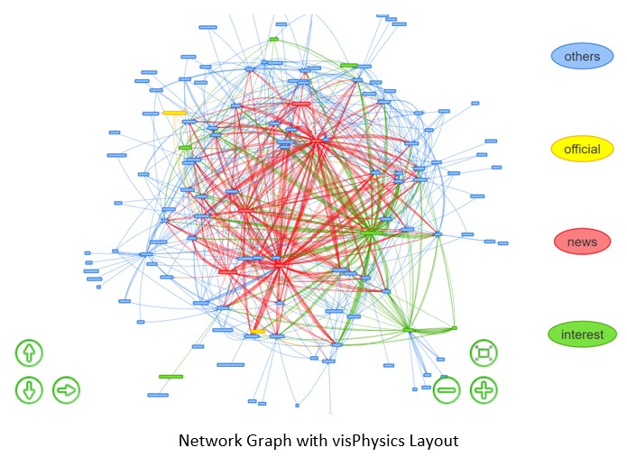
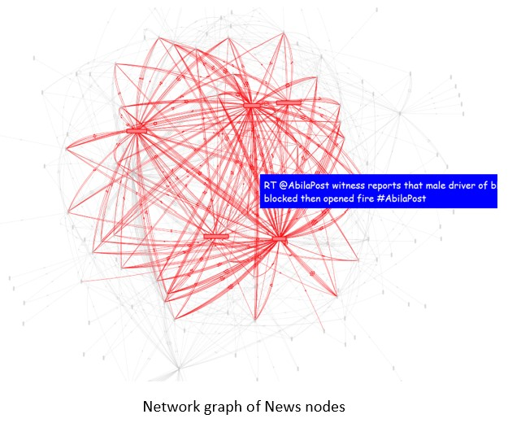
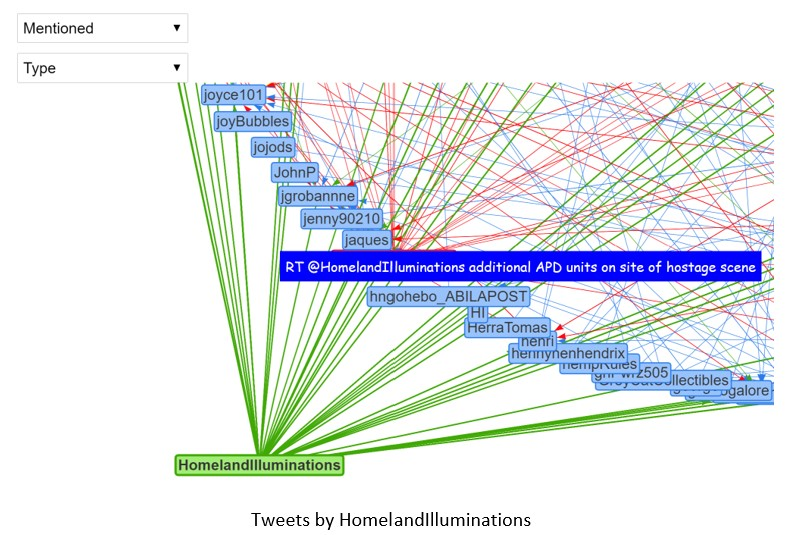
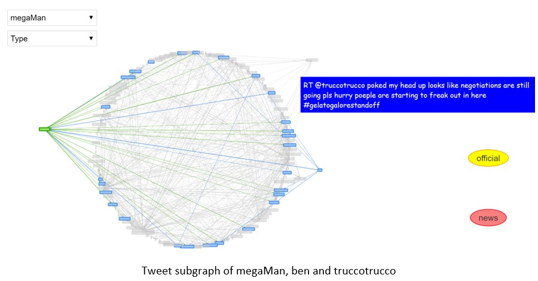
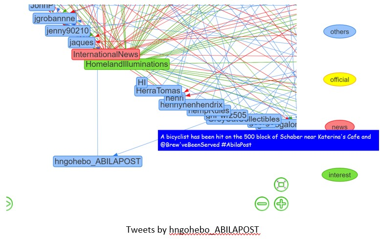
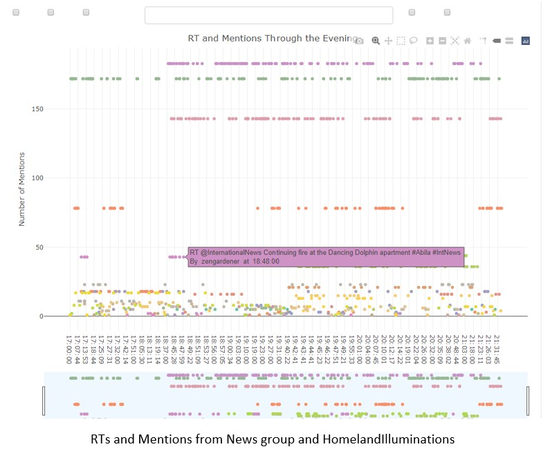

```{r setup, include=FALSE}
knitr::opts_chunk$set(fig.retina = 3,echo = TRUE, eval = TRUE, warning = FALSE, message = FALSE)
```

This project assumes that the user is unaware of the actual sequence of events and seeks to uncover them solely from the visualisation. Hence the methods outlined here can involve extra steps to cross check and verify if some assumptions made on the initial observations are consistent through. Since this dataset mimics an actual microblogging social network, there will be some inconsistencies in the tweets. In such cases, I had chosen to keep observations that are in line with the overall analysis and point out inconsistencies for readers to make further analysis.   

A sizable number of messages in this dataset are retweets (RTs). In most microblog analysis, RTs are removed, leaving only unique messages as RTs are essentially duplicate messages that can skew the analysis. However, for this project, RTs are kept as the frequency of RT messages is an indication of how many authors are also experiencing the same situation as the RT.   

## Data Preparation 

The data from the three csv files are first extracted and combined into one tibble dataframe for wrangling using the R tidyverse suite of packages. (You can find out more about tibble dataframe [here](https://r4ds.had.co.nz/tibbles.html).  

## Install and load all necessary packages

The following packages are loaded:   

```{r}
packages = c('tidyverse', 
             'ggplot2',  #static plots
             'plotly',   #interactive plots
             'crosstalk',  #html widgets
             'lubridate', #format datetime
             'date', #functions for handling dates
             'hms',   #format time
             'VIM', #visualise missing values
             'patchwork', #combination plots
             'tidygraph', #tidy graph manipulation
             'ggraph',  #graphing network
             'visNetwork'  #graphing interactive networks
             )
for(p in packages) {
  if(!require(p,character.only = T)){
    install.packages(p)
  }
  library(p, character.only = T)
}
```

## Import and extract relevant data

The three csv files have the same structure and column headers, *read_csv* is used to import and extract the relevant columns from each file into R and *map_dfr* is used to append the three files into a one. A new column, *source*, is created to append the name of the csv file that the row was extracted from.  

```{r}
df_list <- list.files(path = "./New/",pattern=".csv", full.names = TRUE)
comb <- df_list %>% set_names() %>% map_dfr(read_csv, .id = "source")
```

The datetime column is a string of digits,  yyyyMMddHHmmss, *gsub* is used to split and insert the separators so that the string is now in the form * "d/m/Y H:M:S". Next, *as.Date* is used to change the format to *date time* and to further extract the time component. *as_hms* from the [hms](https://www.rdocumentation.org/packages/hms/versions/1.1.0) package is used to convert it into a *time* format.   

```{r}
comb$datetime <- gsub("^(\\d{4})(\\d{2})(\\d{2})(\\d{2})(\\d{2})(\\d{2})$",
                      "\\3-\\2-\\1 \\4:\\5:\\6", 
                      comb$`date(yyyyMMddHHmmss)`, 
                      perl=TRUE)

comb$datetime <-strptime(comb$datetime,format = "%d-%m-%Y %H:%M:%S")
comb$date <- as.Date(comb$datetime, format = "%d/%m/%Y H:M:S")
comb$time <- format(as.POSIXct(comb$datetime,format="%d-%m-%Y %H:%M:%S"),"%H:%M:%S")
comb$time <- as_hms(comb$time)
```

The data frame is converted to a tibble using *as_tibble*. As the records are from a microblog which can contain some special characters, all columns of the *character* type converted to *UTF-8*.   

```{r}
comb <- as_tibble(comb) %>% mutate_if(is.character, function(col) iconv(col, to="UTF-8"))
```

The filenames in *source* are quite long, so they are renamed as *”Part1”*, *”Part2”* and *”Part3”* respectively. I also renamed *message* to *text* for better comprehension.  

```{r}
comb1 <- comb %>% select(-`date(yyyyMMddHHmmss)`)%>% 
  dplyr::rename(Text = message) %>% 
  mutate(source = recode(source, 
                         `./New/csv-1700-1830.csv`="Part1",
                         `./New/csv-1831-2000.csv`="Part2",
                         `./New/csv-2001-2131.csv`="Part3" ))

```

Create a new row to detect if the message is a RT by using *str_detect* and regular expression pattern.   

```{r}
comb1 <- comb1 %>% 
  mutate(is_RT = case_when(str_detect(Text, "^RT @") ~ "True", TRUE ~ "False"))
```

Use *glimpse* to view the columns of the dataset and check that the data type is correct.  

```{r}
glimpse(comb1)
```

*source*, *type*, *author*, *Text*, *location* and *is_RT* are of the *character* type as required, while *datetime* is of the *datetime* type, *date* is of the *date* type, *time* is of the *time* type and *latitude* and *longitude* are number strings denoted by *dbl* as required.   

Create a stacked bar chart using *ggplot* to view the distribution of data type by source.   

```{r}
comb1 %>% group_by(source) %>% 
  count(type) %>% 
  ungroup() %>%
  ggplot(aes(x= source, y =n, fill = as.factor(type))) + 
  geom_col() + 
  labs(title = "Distribution of data type by source file", 
         x = "Source file", 
         y = "Number of records", fill= "Type") + 
  geom_text(aes(label = n), size = 3, position = position_stack(vjust = 0.5))

```
There are much fewer *ccdata* compared to *mbdata*. 

## Creating Visualizations to Explore the data

The [VIM](https://cran.r-project.org/web/packages/VIM/index.html) package provides a function that gives us a visualisation of the missing values. 

```{r}
aggr(comb1,plot = TRUE,bars=TRUE)
```
As documented in the [source](https://vast-challenge.github.io/2021/MC3.html), *author*, *latitude* and *longitude* are unavailable for all *ccdata*.  *location* is unavailable for all *mbdata* while *latitude* and *longitude* are unavailable for most of the *mbdata*.   

### Grouped Bar Chart by Author 

None of the tweets are missing so I will proceed to group the *mbdata* by *author* to find the number tweets made by each author that evening. I will also create columns to count the number of mentions made by the author and the number of hashtags used.   

```{r}
comb2 <- comb1 %>% 
  filter(type=="mbdata")  %>% 
  dplyr::group_by(author) %>% 
  summarise(no_of_tweets = length(Text), 
            hashtags = sum(str_count(Text, "#\\S+")), 
            mentions = sum(str_count(Text, "@\\S+")), 
            retweets = sum(str_count(Text, "RT @"))) %>%
  arrange(desc(no_of_tweets), .by_group=TRUE)
```

*plotly* is used to create an interactive graph to explore the relationship between the authors and the metrics. The coloured legend at the upper right-hand side allows users to click and filter the chart base on the metric they want to view. *plotly* also allows users to zoom in to view specific sections of the dataset in greater detail. A *tooltip* is activated upon hover so that the user can see all the metrics for that author.   

```{r}
p <- comb2 %>% 
  plot_ly(x=~author, y=~no_of_tweets, 
          type ='bar', 
          name = 'Number of Tweets', 
          hoverinfo = 'text',
          text = ~paste(author, "</br></br>Tweets: ",
                        no_of_tweets, "</br>Hashtags: ", 
                        hashtags, "</br>Mentions: ", 
                        mentions,"</br>Retweets: ", retweets)) %>% 
  add_trace(y =~hashtags, name = 'Number of Hashtags') %>% 
  add_trace(y =~mentions, name = 'Number of Mentions') %>% 
  add_trace(y =~retweets, name = 'Number of Retweets') %>% 
  layout(title = "Text Metrics by Author", 
         yaxis = list(title = 'Count'), 
         barmode = 'group') 

p
```

Filtering for only *Number of Tweets* and *Number of Hashtags* by clicking on the legend, we see that there are two authors, *KronosQuoth* and *Clevvah4Evah*, who had posted huge number of tweets and hashtags. *Clevvah4Evah* sent an average of 4.7 tweets per minute with an average of 2 hashtags per text message. While *Clevvah4Evah* sent an average of 0.6 tweets per minute with an average of 3 hashtags per text message. From *tooltip*, we find that these two authors do not have any mentions or RTs, hence they look very suspicious and further exploration will be done to check if they are indeed authors posting authentic text or just spam bots.   

```{r}
comb1 %>% filter(author == "KronosQuoth") %>% select(Text)
```
Tweets by *KronosQuoth* are composed of pseudo-sayings with several duplicated messages. They are mostly appended with *#POKRally* and *#HI* but the content is unrelated to the rally.   

```{r}
comb1 %>% filter(author == "Clevvah4Evah") %>% select(Text)
```
Tweets by *Clevvah4Evah* are random statements that also contains several duplicated messages. They are mostly appended with *#POK* , *#Rally* and *#Grammar* but once again, the content is unrelated to the rally. We will drop these two authors from subsequent analysis as they are not meaningful.   

## Mentions Network Graph

Even though we have removed 1418 records by filtering away *KronosQuoth* and *Clevvah4Evah*, the dataset is still too large to read all the entries in detail. I choose to use *RTs* and *mentions* as a blunt filter for the important messages because important messages are more likely to be echoed as a mention or RT by other users in the social network.  

In our graph network, the edges will point away from the source author. For example *rrWine* posted the following message *” RT @AbilaPost POK rally set to take place in Abila City Park …”*. *AbilaPost* is the source of the message hence a link will point away from *AbilaPost* to *rrWine* in the network. The number of out going links shows how many messages by the source author has been retweeted and will be used as the weight.  

To prepare the dataframe, I extracted all the mentions from each tweet using *str_extract_all* and a regular expression pattern. Next, *unnest* will convert the mentions into a row of its own. *group_by* and *add_tally* counts the number of mentions by the same author, which will be used as the weights.   

```{r}
comb1_mentions2 <- comb1 %>% 
  mutate(mentions = str_extract_all(Text, "@\\S+")) %>% 
  unnest(mentions)%>% 
  group_by(mentions) %>% 
  add_tally()  %>% 
  ungroup() %>% 
  arrange(time)

comb1_mentions3 <- comb1_mentions2 %>% 
  mutate(mentions = str_remove(mentions, "^\\@"))
```

For the node set, I extracted the set of unique authors from the *author* column and the set of unique *author* from the *mentions*. *visNetwork* requires the nodes labels to be named as *label*, so rename *author* as *label*. Use *full_join* to obtain all the unique authors from both sets.  

```{r}
author_unique <- comb1_mentions3 %>% 
  select(author) %>% 
  distinct(author) %>% 
  rename(label = author)

mentions_unique <- comb1_mentions3 %>% 
  select(mentions) %>% 
  distinct(mentions) %>% 
  rename(label = mentions)

nodes <- full_join(author_unique, mentions_unique, by = "label") %>%
  arrange(label)
```

The next part of the code appends an *id* to each node for the creation of the edge set. 

Here, I also included the code to create the groups found from my exploration of the network. I will include the colour coding in the rendered graph so that it is easier to see the different author groups. How these groups are found will be discussed shortly with the visualisation below.   

```{r}
nodes <- nodes %>% 
  rowid_to_column("id") %>% 
  mutate(group = if_else(label == "AbilaPost" | 
                           label == "KronosStar" | 
                           label == "CentralBulletin" | 
                           label == "InternationalNews"| 
                           label == "NewsOnlineToday", "news", 
                         if_else(label == "AbilaFireDept" |
                                   label =="AbilaPoliceDepartment", 
                                 "official" , 
                                 if_else(label == "truccotrucco"| 
                                           label == "megaMan"|
                                           label == "ben" | 
                                           label == "Simon_Hamaeth"| 
                                           label == "sofitees" | 
                                           label == "hngohebo_ABILAPOST" |
                                      label=="HomelandIlluminations",
                                      "interest",  
                                      "others")
                                 )
                         )
         )
```

Next, I create the edge set by using *select* to extract the required columns. Each edge is created from *mentions* to *author* and *Text* is included so that it can be displayed in *tooltip* later.  


```{r}
edge <- comb1_mentions3 %>% select(author, mentions, Text)
```   

Obtain the id of the "from" and "to" nodes using *left_join* with the node set.  

```{r}
edges <- edge %>% 
  left_join(nodes, by = c("mentions" = "label")) %>% 
  rename(from = id)

edges <- edges %>% 
  left_join(nodes, by = c("author" = "label")) %>% 
  rename(to = id) %>% rename(title = Text)
```

Use *add_tally* to obtain the degree of each *mention* node to be used as the weight.  

```{r}
edges <- select(edges, from, to,title) %>% 
  group_by(from) %>% 
  add_tally() %>% 
  ungroup() 
```
Add the weight, *n*, to the node set.  


```{r}
nodes <- nodes %>% 
  left_join(select(edges, n, from), by = c("id" = "from")) %>% 
  distinct(id, label, group, n) %>%  
  rename(value = n)  
```

Two common measures of the importance of a node in a network is the degree centrality and betweenness centrality. The strength is defined as the sum of the weights of all edges incident to a node. We calculate node strengths by passing the argument weights to *centrality_degree()*. Since our network is directed, we will use the out-strength as our measure of degree centrality.   

Betweenness centrality quantifies the number of times a node acts as a bridge along the shortest path between two other nodes. There are only 8 nodes with a betweenness score that is greater than zero.  

Both degree centrality and betweenness centrality will be found using the *tidygraph* package. Visualising the top 10 authors for each measure using a bar chart created using the *ggplot* package.  

```{r}
mentions_graph <- tbl_graph(nodes = nodes, edges = edges, directed = TRUE)
mentions_graph %>%
  activate(edges) %>%
  arrange(desc(n))

g <- mentions_graph %>% 
  activate(nodes) %>% 
  mutate(
    in_strength = centrality_degree(weights = n, mode = "in"), 
    out_strength = centrality_degree(weights = n, mode = "out"),
    strength = centrality_degree(weights = n, mode = "all")) %>%
  as_tibble()

gp <- g %>% 
  arrange(desc(out_strength)) %>% 
  top_n(10,out_strength) %>% 
  mutate(label = fct_reorder(label, out_strength)) %>% 
  ggplot(aes(x = label,y = out_strength, fill = label)) + 
  coord_flip() + 
  geom_col(show.legend = FALSE) + 
  labs(title= "Centrality degree of Authors by Out Strength", 
       x = "Authors", y = "Out Strength")

g1 <- mentions_graph %>% 
  activate(nodes) %>% 
  mutate(betw = centrality_betweenness()) %>% 
  arrange(desc(betw)) %>% 
  as_tibble()

gp1 <- g1 %>% 
  slice_head(n = 8) %>% 
  mutate(label = fct_reorder(label, betw)) %>% 
  ggplot(aes(x = label,y = betw, fill = label)) + 
  coord_flip() + 
  geom_col(show.legend = FALSE) + 
  labs(title= "Betweeenness Centrality of Authors", 
       x = "Authors", y = "Betweenness Centrality")

gp + gp1
```
 
There are some overlaps in the nodes identified by the centrality measures and we will take a closer look at them using a network graph.   
The [ggraph]( https://www.rdocumentation.org/packages/ggraph/versions/2.0.5) package allows me to use the *centrality_closeness* as the colour and *centrality_betweenness* as the size in the network. The resulting static graph shows that there is a node with high closeness and betweenness centrality, however it is difficult to identify it as the graph is too cluttered.   

```{r}
g2 <-
  ggraph(mentions_graph, layout = "nicely") + 
  geom_edge_link(edge_colour = "gray77", alpha = 0.5) +
  geom_node_point(aes(colour = centrality_closeness(), size=centrality_betweenness())) +
  theme_graph() + scale_colour_gradient(low = "#00008B", high = "#63B8FF") + 
  geom_node_text(aes(label = label,size=25), repel = TRUE) + 
  ggtitle("Network Graph of Mentions using Centrality") + theme(text=element_text(family="mono"))

g2
```
I will use an interactive network graph of *authors* to visualise the *mentions* and *RTs* to overcome the issues in a static graph. The interactivity will allow me to visualise and identify important nodes in the network and *tooltip* will be used to display the *text message* so that I do not need to filter the data table for it. I will also use the network to further investigate the top authors identified by the centrality measures.   

```{r}
legend_nodes <- data.frame(label = unique(nodes$group))

visNetwork(nodes, edges, 
main = "Network of Mentions", 
height = "500px", 
width = "100%") %>% 
visEdges(arrows = "top")%>% 
visIgraphLayout(layout = "layout_as_star")%>%  
visInteraction(dragNodes = TRUE, 
dragView = TRUE, 
zoomView = TRUE, 
multiselect = TRUE,
navigationButtons = TRUE, 
tooltipStyle = 'position: fixed;visibility:hidden;padding: 5px;white-space: wrap;
 font-family: cursive;font-size:12px;font-color:purple;background-color: blue;') %>%
  visNodes( labelHighlightBold = TRUE, font = list(size=30), shape="box") %>%
  visOptions(highlightNearest = list(enabled = TRUE, 
                                     hover = FALSE, 
                                     algorithm ="hierarchical"),
             nodesIdSelection = list(enabled = TRUE, 
                                     main = "Mentioned"),
             selectedBy = list(variable="group", main="Type"))  %>%
  visLegend(width=0.2, position="right", zoom=FALSE, useGroups = TRUE) 
```
The [visNetwork](https://cran.r-project.org/web/packages/visNetwork/vignettes/Introduction-to-visNetwork.html) package allows users to build interactive network visualisations. It was selected for its capabilities in handling large number of nodes by it *visPhysics* layout function, and also its intuitive *highlighting* and *drag* functions when analysing the graph.   

When creating the network and testing the layout options, I found that *visPhysics* produces the best layout as the nodes are spaced apart with no overlaps and it is easy to see the nodes with the most edges. However, the network graph is too large for the graph to stabilise, ie. in the visualisation the network will not stop “trembling”. Running this option is also computationally taxing and graph will be slow to render. Hence, I will only show the screenshots of the network produced by *visPhysics* function and use the *visIgraphLayout* option in the code chunk below. The code chunk for the *visPhysics* function will be included in the appendix if the reader is keen to try it out another time.   

   

From the network graph, I first locate the nodes identified with high degree centrality scores. By hovering on their links to read some of their tweets, I discovered the outgoing links of the top nodes are retweets of informative news reports. Hence, I grouped *AbilaPost*, *KronosStar*, *CentralBulletin*, *InternationalNews*, *NewsOnlineToday* as *news*.   

   
Other authors with high degree centrality are *HomelandIlluminations*, *megaMan*, *truccotrucco* and *ben*. *HomelandIlluminations* is a very informative source, giving updates about a fire at *Dancing Dolphin* and the evacuation of residents. Furthermore, a possible hit-and-run, police stand-off, SWAT team and hostage scene were also mentioned.   

   

From their tweets, we learn that *megaMan*and *ben* knows each other, and they are passing information about a situation involving a black van and the police. Their most retweeted message was “@ben ITS THE SECOND VAN GUY!”. Examining the content of *megaMan* and *truccotrucco* reveals that they were both tweeting about a standoff between a black van and the police outside gelatogalore, with *megaMan* being a close observer of the black van and *truccotrucco* inside gelatogalore when the standoff was taking place.   

  

Other nodes with high degree centrality or betweenness scores are *FriendsOfKronos*, *POK* and * Choconibbs*.  They were all mainly tweeting about the POK Rally, with *POK* giving updates and supporting the rally and *FriendsOfKronos* and * Choconibbs* criticising and dismissive of the rally. Tweets from *trollingsnark* were mainly criticisms or disparaging remarks. As his messages were not meaningful, we will exclude them for further analysis.  

Finally, *hngohebo_ABILAPOST* posted one text message and retweeted another. Both tweets were about a hit and run involving a bicyclist near Schaber.  

  
After exploring the network graphs, the nodes were grouped as follows: 

* News: "AbilaPost", "KronosStar","CentralBulletin", "InternationalNews", "NewsOnlineToday"

* Official: "AbilaFireDept", "AbilaPoliceDepartment"

* Interest: "truccotrucco", "megaMan", "ben", "Simon_Hamaeth", "sofitees", "hngohebo_ABILAPOST", "HomelandIlluminations"

* Others: the rest 

It is interesting to note that *Viktor-E* was the only author who mentioned himself. Also since regular expression was used to extract the authors in the mentions, a message with a missing space caused *dancingdolphin?#AbilaPost* to be recorded as a different author from the actual *dancingdolphin*. The error was easy to spot as the nodes were arranged alphabetically.  

## Dot Plot of RTs and Mentions 

After identifying key authors of information, I used an interactive dot plot to visualise their tweets in chronological order to understand how the events mentioned unfolded over the evening. Using [plotly]( https://plotly.com/r/) and the [crosstalk]( https://rstudio.github.io/crosstalk/) package, allows users to filter for specific authors for different time periods.  

I used the previously cleaned dataset of mentions and RTs as the *highlight_key* so that *mentions* will be a filter option. Next, some checkboxes and select filters were created to allow users to select the *timeframe*, *author*, and *is_RT*.  

```{r}
tx <- highlight_key(comb1_mentions2)
widgets <- bscols(
  widths = c(3, 6, 3),
  filter_checkbox("source", "Time Period", tx, ~source, inline = TRUE),
  filter_select("mentions","Mentions",tx,~mentions),
  filter_checkbox("RT", "RT", tx, ~is_RT, inline = TRUE)
)

```

*plot_ly* is used to create the graph and *bscols* is used to specify the layout of the filter widgets and the plots. 

```{r}
bscols(widths =c(12,12), 
       widgets, 
       plot_ly(tx, x = ~time, y=~n, 
               showlegend = FALSE, 
               color = ~factor(mentions) , 
               hoverinfo ='text', 
               text=~paste(Text, "</br></br>By ",
                           author, " at ", 
                           time), 
               width = 900, height =600)%>% 
         layout(title = "RT and Mentions Through the Evening", 
                xaxis = list(title = "Time", 
                             rangeslider = list(bgcolor = "#f0f8ff" ,
                                                type = "time"), 
                             categoryarray = ~time, 
                             categoryorder='array'), 
                yaxis = list(title = "Number of Mentions"),
                autosize=T) %>% 
         add_markers()
)
```

Filtering for all the news groups and *HomelandIlluminations*, laid out the events of the evening in chronological order.  
For example, *HomelandIlluminations* was the first to report the fire at Achilleos & Madeg. Later that evening, *KronosStar* described an “erratic driver who ran a red light” at around the same time that *HomelandIlluminations* reported a hit and run. *KronosStar* subsequently reported that the driver was being cornered by the police in a parking lot near Alexandrias and Ithakis and later shots were fired. This led to APD units sent to the shooting area. And later *AbilaPost* reported that the stand off ends peacefully.   

  


